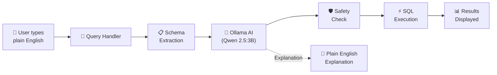

# 🧠 NL-DB — Natural Language Database Manager

### _Talk to your database in plain English._

[](LICENSE)
[](https://www.python.org/)
[-41CD52.svg?logo=qt&logoColor=white)](https://doc.qt.io/qtforpython/)
[-000000.svg)](https://ollama.com/)

> **NL-DB** is a desktop application that lets you query **SQLite** and **PostgreSQL** databases  
> using natural language — powered by a **locally-running AI model** via [Ollama](https://ollama.com/).  
> No API keys. No cloud. 100% private.

**Created & maintained by [@0xSubhan](https://github.com/0xSubhan)**

---

## ✨ Features

| Feature | Description |
|---|---|
| 🗣️ **Natural Language Queries** | Type questions in plain English and get SQL + results instantly |
| 🔒 **Destructive Query Protection** | Detects `DROP`, `DELETE`, `TRUNCATE`, `ALTER`, `UPDATE` and asks for confirmation before executing |
| 📊 **Three-Panel Professional UI** | Database Browser · Query Panel · Schema Inspector — macOS-inspired light theme |
| 🐘 **Multi-Database Support** | Works with both **SQLite** (file-based) and **PostgreSQL** (remote/local server) |
| 🤖 **Fully Local AI** | Uses Ollama with **Qwen 2.5 (3B)** — runs entirely on your machine, zero data leaves your system |
| 💬 **SQL Explanation** | Every generated query comes with a plain-English explanation of what it does |
| 🔍 **Schema Inspector** | View column types, primary keys, constraints, sample data, and query history at a glance |
| 📁 **Recent Files** | Quick-access list of recently opened SQLite databases |
| 📤 **CSV Export** | Export query results to CSV with one click |
| ⌨️ **Keyboard Shortcuts** | `Ctrl+Enter` to run, `Ctrl+O` to open, `Ctrl+N` for new DB, `Ctrl+I` to toggle schema, and more |

---

## 🏗️ Architecture

```
nl-db/
├── main.py                    # Application entry point
├── pyproject.toml             # Project metadata & dependencies
│
├── app/
│   ├── __init__.py
│   ├── db_connection.py       # SQLiteConnection & PostgresConnection classes
│   ├── query_handler.py       # NL → SQL translation via Ollama + execution engine
│   │
│   └── ui/
│       ├── __init__.py
│       ├── main_window.py     # Main 3-panel window with menu/status bars
│       ├── db_browser.py      # Left panel  — database tree & recent files
│       ├── query_panel.py     # Center panel — NL input, results table, explanation
│       ├── schema_inspector.py# Right panel  — column details, sample data, history
│       ├── postgres_dialog.py # PostgreSQL connection credentials dialog
│       ├── safety_dialog.py   # Destructive query confirmation dialog
│       └── styles.qss         # Application-wide Qt stylesheet
│
├── tests/
│   ├── test_db.py             # Database connection unit tests
│   └── test_handler.py        # Query handler unit tests (with mocked Ollama)
│
└── data/                      # Default directory for SQLite database files
```

### How It Works



1. **You type a question** in the Natural Language Query Panel (e.g., _"show top 5 customers by total spend"_)  
2. **The app reads the database schema** (tables, columns, types, constraints)  
3. **A prompt is built** with the schema context and your question, then sent to the local Ollama model  
4. **The AI generates SQL** tailored to your database dialect (SQLite or PostgreSQL)  
5. **A safety check** scans the generated SQL for destructive keywords — if found, you get a confirmation dialog  
6. **The SQL executes** against your database and results are displayed in a sortable table  
7. **A plain-English explanation** of the SQL is generated in the background and shown below the results  

---

## 🚀 Getting Started

### Prerequisites

| Requirement | Version | Purpose |
|---|---|---|
| **Python** | 3.10+ | Runtime |
| **Ollama** | Latest | Local AI inference engine |
| **PostgreSQL** _(optional)_ | Any | Only if you want to query Postgres databases |

### 1. Clone the Repository

```bash
git clone https://github.com/0xSubhan/Natural_Language_Database_System_Ai_Integrated.git
cd Natural_Language_Database_System_Ai_Integrated
```

### 2. Set Up a Virtual Environment

```bash
cd nl-db
python -m venv venv
source venv/bin/activate        # Linux / macOS
# venv\Scripts\activate         # Windows
```

### 3. Install Dependencies

```bash
pip install -e ".[test]"
```

This installs:
- **PySide6** ≥ 6.7 — Qt6 GUI framework
- **requests** ≥ 2.31 — HTTP client for Ollama API
- **psycopg2-binary** ≥ 2.9.9 — PostgreSQL adapter
- **pytest** ≥ 8.0 — _(test dependency)_

### 4. Install & Start Ollama

Follow the [Ollama installation guide](https://ollama.com/download) for your OS, then pull the model:

```bash
ollama pull qwen2.5:3b
```

Make sure Ollama is running (it serves on `http://localhost:11434` by default):

```bash
ollama serve
```

### 5. Launch the Application

```bash
python main.py
```

The application window will open with the three-panel interface ready to use.

---

## 📖 Usage Guide

### Connecting to a Database

#### SQLite
- Click **"Open Database"** (or `Ctrl+O`) to open an existing `.db` / `.sqlite` file
- Click **"New Database"** (or `Ctrl+N`) to create a fresh SQLite database
- Double-click any item in the **Recent Files** list to quickly reopen it

#### PostgreSQL
- Click **"Connect PG"** or go to **File → Connect PostgreSQL**
- Enter your connection credentials (host, port, username, password, database name)
- Click **Connect**

### Querying with Natural Language

1. Type your question in plain English in the input box  
   _Examples:_
   - `"Show all users"`
   - `"What are the top 10 products by revenue?"`
   - `"Count orders placed in the last 30 days"`
   - `"List tables and their row counts"`
2. Press **`Ctrl+Enter`** or click **"Run NatLang"**
3. View:
   - **Generated SQL** — toggle visibility with `Ctrl+S`
   - **Results Table** — sortable, with row count
   - **Plain English Explanation** — auto-generated below the results

### Exporting Results

Click the **"Export CSV"** button that appears below the results table to save query results as a `.csv` file.

### Keyboard Shortcuts

| Shortcut | Action |
|---|---|
| `Ctrl+Enter` | Execute natural language query |
| `Ctrl+O` | Open an existing database |
| `Ctrl+N` | Create a new database |
| `Ctrl+S` | Toggle SQL panel visibility |
| `Ctrl+I` | Toggle Schema Inspector panel |
| `Ctrl+Q` | Quit the application |
| `Esc` | Cancel / clear the current query input |

---

## 🧪 Running Tests

```bash
cd nl-db
pytest tests/ -v
```

Tests use **mocked Ollama responses**, so you don't need a running Ollama instance to run them.

---

## 🛡️ Safety & Security

NL-DB includes a **built-in safety layer** that scans every AI-generated SQL query before execution:

- ✅ `SELECT` queries execute immediately
- ⚠️ Destructive operations (`DROP`, `DELETE`, `TRUNCATE`, `ALTER`, `UPDATE`) trigger a **warning dialog** — nothing runs until you explicitly confirm  
- 🔒 All AI processing happens **locally** through Ollama — your data never leaves your machine

---

## 🔧 Configuration

| Setting | Default | Notes |
|---|---|---|
| Ollama URL | `http://localhost:11434` | Standard Ollama endpoint |
| AI Model | `qwen2.5:3b` | Lightweight, fast, and capable of SQL generation |
| SQLite Data Dir | `nl-db/data/` | Default directory for database files |
| Recent Files Limit | 5 | Stored in `nl-db/data/recent_files.json` |

---

## 🤝 Contributing

Contributions are welcome! Here's how to get started:

1. **Fork** the repository
2. **Create** a feature branch (`git checkout -b feature/amazing-feature`)
3. **Commit** your changes (`git commit -m 'Add amazing feature'`)
4. **Push** to the branch (`git push origin feature/amazing-feature`)
5. **Open** a Pull Request

---

## 📄 License

This project is licensed under the **MIT License** — see the [LICENSE](LICENSE) file for details.

```
MIT License · Copyright (c) 2026 Subhan Khan
```

---

### Made with ❤️ by [@0xSubhan](https://github.com/0xSubhan)

_If you found this project useful, consider giving it a ⭐_
